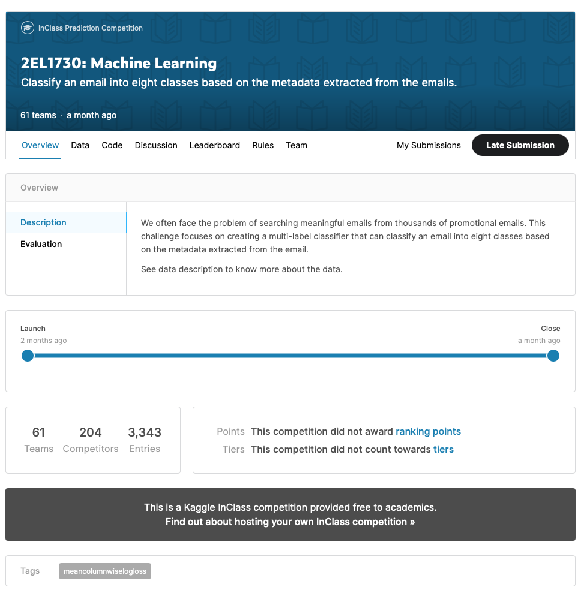
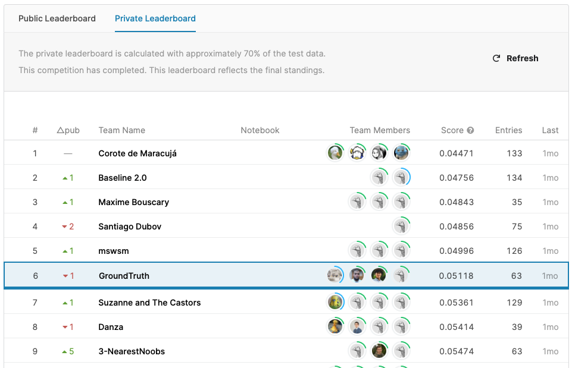

# kaggle-challenge-cs

This repository contains the work of the *GroundTruth* team for the Kaggle Challenge of the *Machine Learning* course at CentraleSupélec. Our team ended up 6th out of 61 teams.

You can find in the `Report` directory that contains a report describing the various techniques we have used.

**Description of the competition:**

We often face the problem of searching meaningful emails from thousands of promotional emails. This challenge focuses on creating a multi-label classifier that can classify an email into eight classes based on the metadata extracted from the email.

